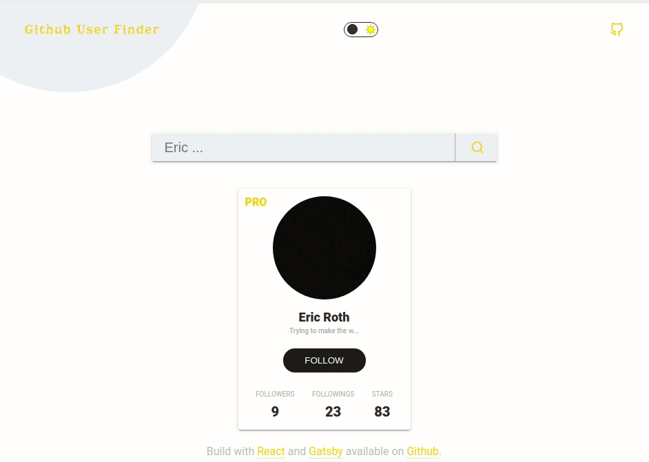

# Github User Finder



Getting user data from Github GrpahQL API's

  
  [Deployed on Netlify live demo]([https://userfinder.netlify.app/](https://userfinder.netlify.app/))

## 🚀 Quick start

  

1.  **Create a Gatsby site.**

  

Use the Gatsby CLI to create a new site.

  

```shell

# cloning this repo and insalling dependencies

gatsby new github-user-finder [https://github.com/lifeeric/github-user-finder](https://github.com/lifeeric/github-user-finder)

```

  

1.  **Start developing.**

  

Navigate into your new site’s directory and start it up.

  

```shell

cd github-user-finder/

gatsby develop

```

  

1.  **Open the source code and start editing!**

  

Your site is now running at `http://localhost:8000`!

  

_Note: You'll also see a second link: _`http://localhost:8000/___graphql`_. This is a tool you can use to experiment with querying your data. Learn more about using this tool in the [Gatsby tutorial](https://www.gatsbyjs.org/tutorial/part-five/#introducing-graphiql)._


## Built With

* [Gatsby](http://www.dropwizard.io/1.0.2/docs/) - The web framework used
* [React](https://maven.apache.org/) - UI libraly
* [Material-ui](https://rometools.github.io/rome/) - Layout framework
* [React darkmode toggler](https://www.npmjs.com/package/react-darkmode-toggler) - Button for switching theme, light, and dark

  
